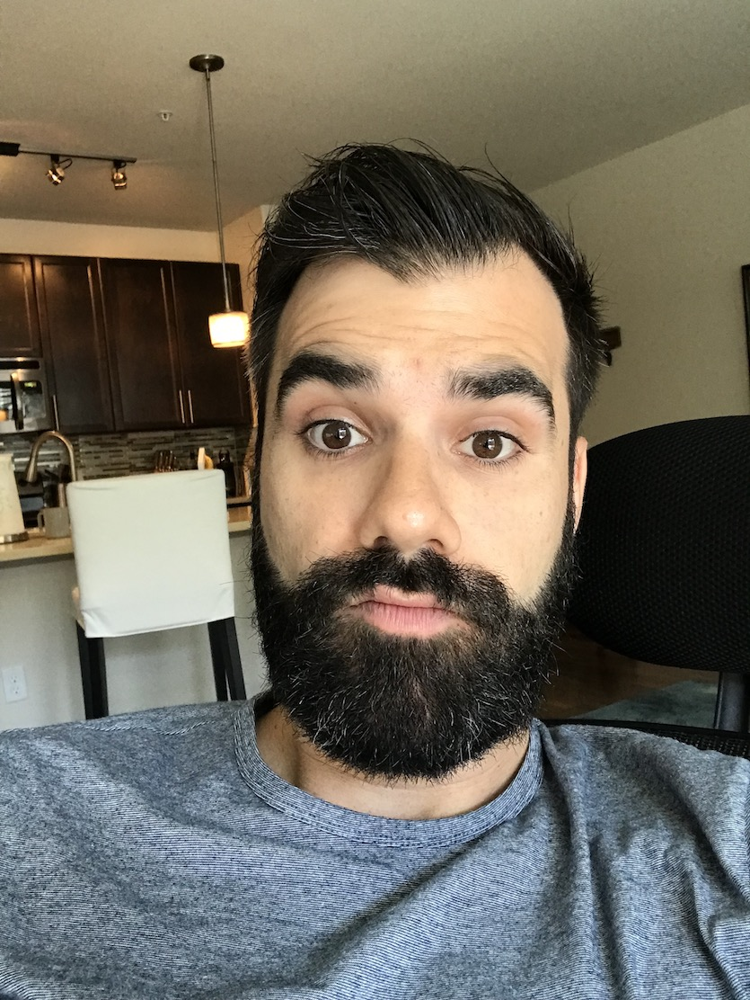
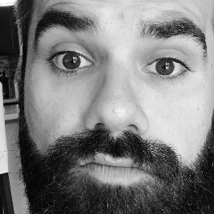

Playing Around With Facial Recognition
-----

The purpose of this repository is to align and crop facial images in preparation for training a model. This repository comes with a series of photos of myself and some celebrities for demo purposes. If you would like to work with your own images, make sure that you maintain the folder structure in `OriginalPhotos`

### Example

#### Input



#### Output



You have many options for training a model. I work for IBM, so you should totally try [IBM Watson](https://dataplatform.ibm.com) to train a model!

Original inspiration for this repo comes from [here](https://github.com/nlhkh/face-alignment-dlib).

### Requirements

- [Python](https://www.python.org)
- [Anaconda](https://www.anaconda.com)


### Setup:
1. Clone this repository.
2. Unzip `dlib-19.15.zip`.
3. In Terminal, navigate to the root of `dlib-19.15` and run `python setup.py install`
4. Go back to the root directory of this entire project, and run `pip install -r requirements.txt`
5. Run `conda install opencv`.

### Batch Photo Cropping

A shell script has been included for convenience. To execute, please type, in Terminal

```bash
./extract.sh
```
You will find cropped photo output in the newly created `ExtractedPhotos` folder.

### Single Photo Cropping
Let's assume the photo you want to crop is called `photo1.jpg`, and you want to name the result `photo1Cropped.jpg`. You would type the following command into terminal:

```bash
python app.py photo1.jpg photo1Cropped.jpg
```

This is useful for testing this script with new photos.

##### Dependencies:
- [dlib](http://dlib.net/)
- [opencv-python](http://docs.opencv.org/3.0-beta/doc/py_tutorials/py_tutorials.html)
